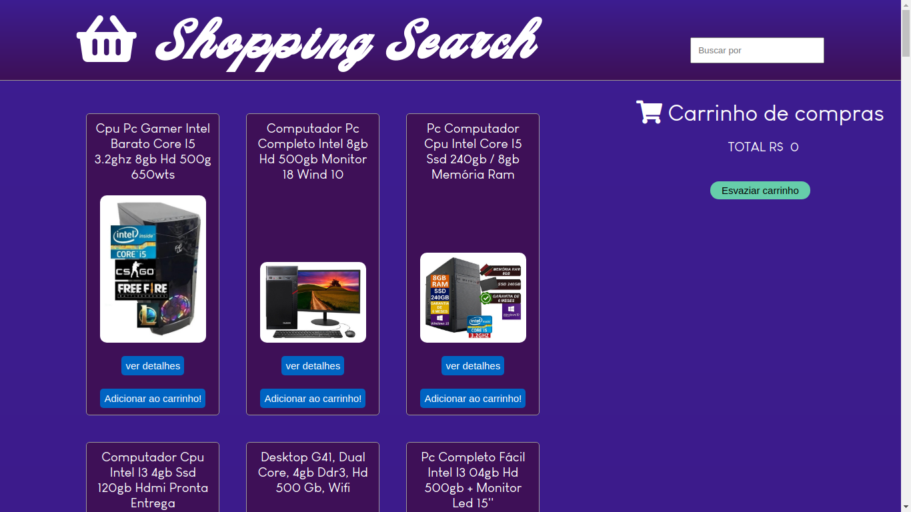
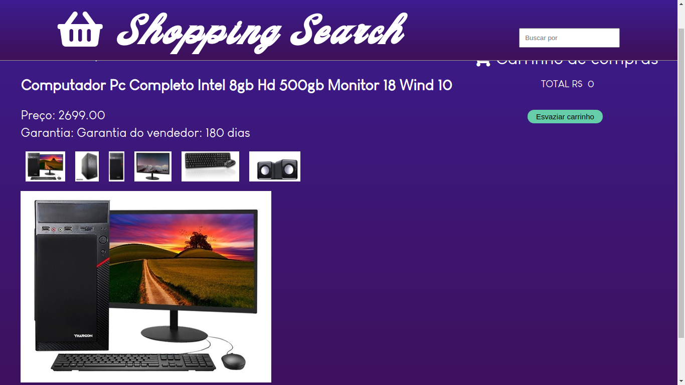
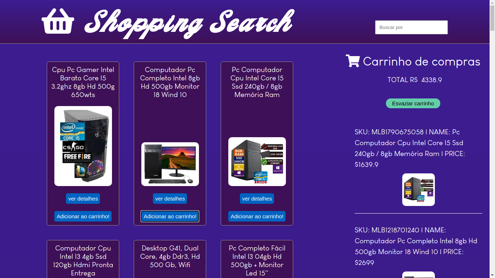
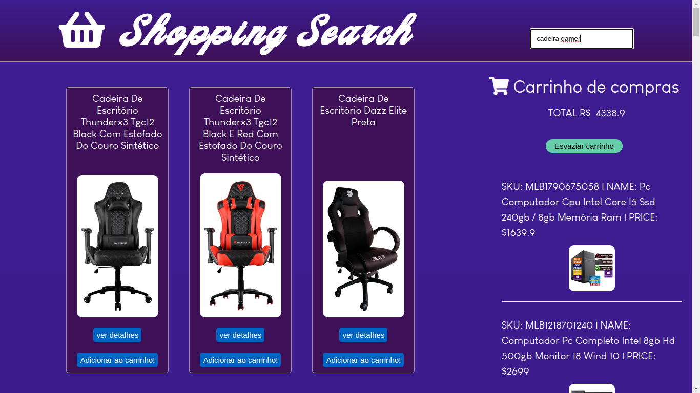
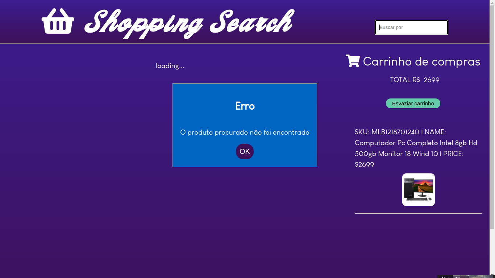

# Shopping Cart :credit_card: 

## Projeto de avaliação feito durante o curso da Trybe, buscando colocar em prática o aprendizado sobre requisições de API (utilizando a API do mercado livre), também utilizar o LocalStoreage para armazenar itens do carrinho de compra, para que assim os mesmo possam ser renderizado na tela novamente depois que o browser for fechado.

 

## Esse projeto foi submetido a testes de 14 requisitos, atingindo 100% dos que foi proposto:

### 1 - Crie uma listagem de produtos

Você deve criar uma listagem de produtos que devem ser consultados através da API do Mercado Livre.

Você deve utilizar o _endpoint_:
```javascript
"https://api.mercadolibre.com/sites/MLB/search?q=$QUERY"
```
onde `$QUERY` deve ser o valor da sua busca. Para este trabalho, a busca deve ser **obrigatóriamente** o termo `computador`.

O retorno desse _endpoint_ será algo no formato `json`. Por exemplo, se for pesquisado "computador":

A lista de produtos que devem ser exibidos é o _array_ `results` no `JSON` acima.

Você **deve** utilizar a função `createProductItemElement(product)` para criar os componentes _HTML_ referentes a um produto.

Adicione o elemento retornado da função `createProductItemElement(product)` como filho do elemento `<section class="items">`.

**Obs:** as variáveis `sku`, no código fornecido, se referem aos campos `id` retornados pela API.

### 2 - Adicione o produto ao carrinho de compras

Cada produto na página _HTML_ possui um botão com o nome `Adicionar ao carrinho!`.

Ao clicar nesse botão você deve realizar uma requisição para o _endpoint_:
```javascript
"https://api.mercadolibre.com/items/$ItemID"
```
onde `$ItemID` deve ser o valor `id` do item selecionado.

Quando colocado o id `MLB1341706310` retorno desse _endpoint_ será algo no formato:

Preste atenção que o JSON deve conter apenas **um** item.

Você **deve** utilizar a função `createCartItemElement()` para criar os componentes _HTML_ referentes a um item do carrinho.

Adicione o elemento retornado da função `createCartItemElement(product)` como filho do elemento `<ol class="cart__items">`.

### 3 - Remova o item do carrinho de compras ao clicar nele

Ao clicar no **produto no carrinho de compra**, ele deve ser removido da lista.
Para isso, uma função (já existente) chamada `cartItemClickListener(event)` deve ser implementada com a lógica necessária para realizar a remoção.

### 4 - Carregue o carrinho de compras através do **LocalStorage** ao iniciar a página

Ao carregar a página, o estado atual do carrinho de compras deve ser carregado do **LocalStorage**.
Para que isso funcione, o carrinho de compras deve ser salvo no **LocalStorage**, ou seja, todas as **adições** e **remoções** devem ser abordadas para que a lista atual seja salva.

### 5 - Some o valor total dos itens do carrinho de compras

Cada vez que se adicionar um item ao carrinho de compras, será necessário somar seus valores e apresentá-los na página principal do projeto. O elemento que tem como filho o preço total dos itens do carrinho deve ter, **obrigatóriamente**, a classe `total-price`.

Obs: Devemos tomar cuidado, no entanto, pois estamos buscando os dados do produto em uma API. Portanto, é necessário garantir que a API já retornou as informações para somente depois realizar o cálculo da soma.

### 6 - Crie um botão para limpar carrinho de compras

Crie um botão para remover todos os itens do carrinho de compras. Ele deve, **obrigatóriamente**, ter a classe `empty-cart`.

### 7 - Adicione um texto de "loading" durante uma requisição à API

Uma requisição à API gasta um tempo e durante ele, ficamos sem saber se está tudo certo ou se algo deu errado.
Normalmente é utilizada alguma forma para mostrar que a requisição está em andamento.
Mostre a palavra "loading..." em algum lugar da página **apenas durante** a requisição à API. O elemento mostrado durante o carregamento da página deve, **obrigatóriamente**, ter a classe `loading`.


## Além dos requisito também foi feito:

- Botão para exibir detalhes do produto para o usuário

   


- Exibir foto do produto no carrinho de compras

    


- Barra de busca para o usuário encontrar o produto desejado

   


- Caixa de mensagens  para interação com o usuário

   